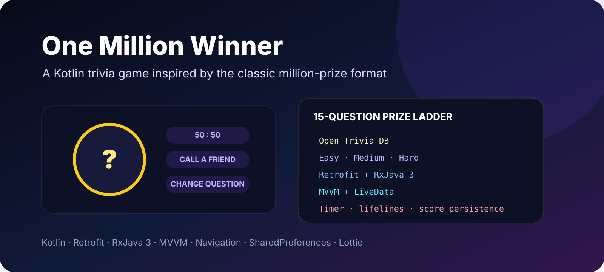

<p align="center"></p>

# One Million Winner

A Kotlin Android trivia game inspired by the classic million-prize quiz format. It loads multiple-choice questions from Open Trivia DB, builds a 15-question game across increasing difficulty levels, applies a prize ladder and includes familiar lifeline mechanics.

> This repository is a fork of [Salmon-family/One_Millon_Winner](https://github.com/Salmon-family/One_Millon_Winner). The upstream repository contains the original collaboration history.

## Gameplay

- 15-question game
- three difficulty levels: easy, medium and hard
- multiple-choice questions
- countdown timer per question
- answer selection and reveal states
- progressive prize ladder from 100 to 1,000,000
- secured prize checkpoints
- win/loss result flow
- best-prize persistence

## Lifelines

The game implements:

- **50:50** — removes two incorrect answers
- **Call a Friend** — exposes the correct-answer helper flow
- **Change Question** — replaces the current question with a spare question of the same difficulty

Each lifeline is tracked so it is not repeatedly consumed during the same game.

## Question source

Questions are fetched from the free Open Trivia Database API:

```
https://opentdb.com/api.php
```

For each difficulty level the app requests multiple-choice questions through Retrofit and combines them into the game model.

## Prize ladder

The internal ladder is:

```
100
200
300
500
1,000
2,000
4,000
8,000
16,000
32,000
64,000
125,000
250,000
500,000
1,000,000
```

Prize checkpoints are applied every five questions.

## Architecture

```
UI
 |
 v
ViewModel
 |
 v
Repository
 | \
 |  \-> SharedPreferences (best score)
 v
Retrofit + RxJava
 |
 v
Open Trivia DB
```

The game-specific models (`TriviaQuestion`, `GameQuestion`, `Choice`, `Prize`) encapsulate answer state, question replacement, prize calculation and game-over rules.

## Tech stack

| Area | Technology |
| --- | --- |
| Language | Kotlin |
| Architecture | MVVM |
| Networking | Retrofit |
| Reactive streams | RxJava 3 / RxAndroid |
| State | LiveData |
| Navigation | Android Navigation Component |
| Local persistence | SharedPreferences |
| UI | XML + Data Binding |
| Animation | Lottie |
| Audio | Android MediaPlayer |
| API | Open Trivia DB |

The app targets Android API 32 and supports devices from API 21.

## Project structure

```
app/src/main/java/com/example/onemillonwinner/
├── data/
│   ├── network/
│   └── questionResponse/
├── ui/
│   ├── home/
│   ├── game/
│   └── result/
└── util/
    └── enumState/
```

## Build

```bash
./gradlew assembleDebug
```

Run tests with:

```bash
./gradlew test
```

An internet connection is required to fetch new trivia questions.

## Repository note

No explicit license file is included in this fork. Check the upstream project before redistribution or relicensing.
